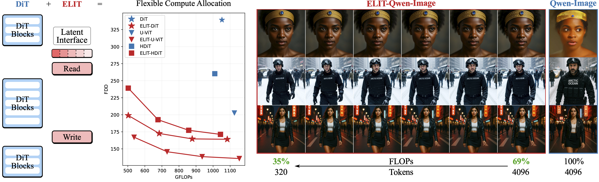
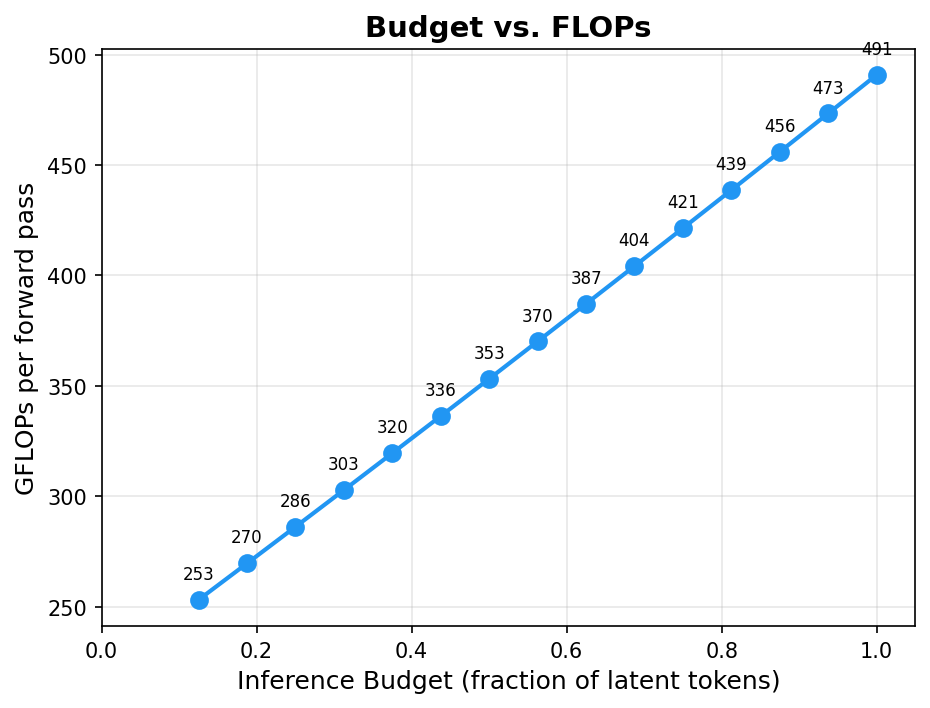
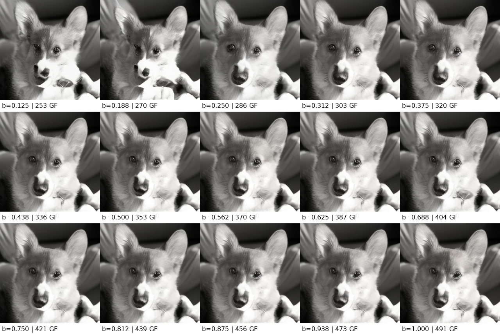
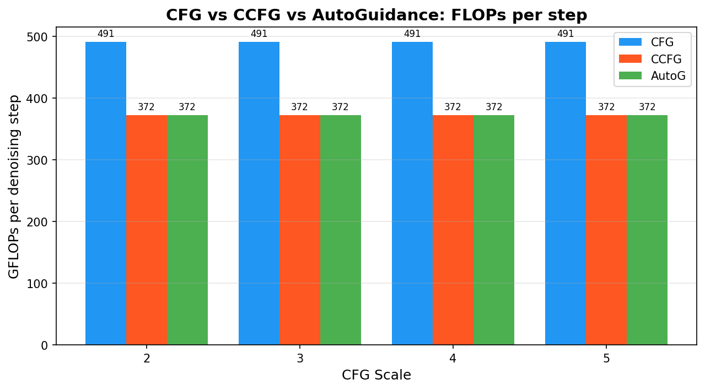
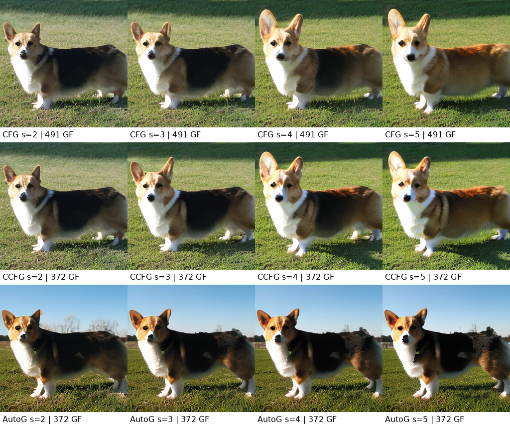

# [CVPR 2026] Elastic Latent Interfaces

[One Model, Many Budgets: Elastic Latent Interfaces for Diffusion Transformers](TODO)


[](https://snap-research.github.io/elit/)
[](https://arxiv.org/abs/2603.12245)
<!-- [](https://github.com/snap-research/elit) -->

**Moayed Haji-Ali<sup>1,2</sup>, Willi Menapace<sup>2</sup>, Ivan Skorokhodov<sup>2</sup>, Dogyun Park<sup>2</sup>, Anil Kag<sup>2</sup>, Michael Vasilkovsky<sup>2</sup>, Sergey Tulyakov<sup>2</sup>, Vicente Ordonez<sup>1</sup>, Aliaksandr Siarohin<sup>2</sup>**

*<sup>1</sup>Rice University, <sup>2</sup>Snap Inc.

## Table of Contents
- [Method Implementation](#method-implementation)
- [Experimental Results and Checkpoints](#experimental-results)
- [1. Environment Setup](#1-environment-setup)
- [2. Dataset](#2-dataset)
- [3. Training](#3-training)
- [4. Sampling](#4-sampling)
  - [4.1 ELIT-SiT](#41-elit-sit)
  - [4.2 Variable Budget Inference](#42-variable-budget-inference)
  - [4.3 Multi-Budget Analysis](#43-multi-budget-analysis)
  - [4.4 Cheap CFG (CCFG)](#44-cheap-cfg-ccfg)
- [5. Evaluation](#5-evaluation)
- [Large-scale Training Strategy](#large-scale-training-strategy)
- [Acknowledgement](#acknowledgement)
- [BibTeX](#bibtex)

## 🚀 Check Out Our Latest Work! 🎥🔊 

> Our other work **[DFM: Decomposable Flow Matching](https://snap-research.github.io/dfm/)** — a simple framework for progressive scale-by-scale generation that achieves up to **50% faster convergence** compared to Flow Matching. **This repo also contains the code for DFM.**

---



## TL;DR

> We found that DiTs waste substantial compute by allocating it uniformly across pixels, despite large variation in regional difficulty. **ELIT** addresses this by introducing a variable-length set of *latent tokens* and two lightweight cross-attention layers (Read & Write) that concentrate computation on the most important input regions, delivering up to **53% FID** and **58% FDD improvements** on ImageNet-1K 512px. At inference time, the number of latent tokens becomes a user-controlled knob, providing a smooth **quality–FLOPs trade-off**  while enabling **~33% cheaper guidance**  out of the box.

---

## Method Implementation

ELIT introduces a minimal change to DiT-like architectures: a **latent interface** — a variable-length token sequence — coupled with lightweight **Read** and **Write** cross-attention layers.

1. A **latent interface** of *K* tokens is instantiated.
2. A lightweight **Read** cross-attention layer pulls information from spatial tokens into the latent interface, prioritizing harder regions using grouped cross-attention.
3. Standard transformer blocks operate on the latent tokens.
4. A **Write** cross-attention layer maps the latent updates back to the spatial grid.
5. During training, tail latents are randomly dropped, making the latent interface importance-ordered.
6. At inference, the number of latents serves as a user-controlled compute knob.

---

## Disclaimer

This repo provides a reimplementation of ELIT on top of SiT, following [REPA](https://github.com/sihyun-yu/REPA) setup. The architecture does not exactly follow the one used in the paper and results might be different. Below, we provide comparison between SiT and ELIT produced using this repo.

---

## Experimental Results

### ImageNet 256×256

| Method | Steps | BS | FID↓ | IS↑ | Precision↑ | Recall↑ | Checkpoint |
|--------|-------|------------|------|-----|------------|---------|------------|
| SiT-XL/2 | 400K | 256 | 18.97 | 73.32 | 0.252 | 0.530 | [sit_imagenet_256px_1k_0400000.pt](https://huggingface.co/mali6/elit/resolve/main/sit_imagenet_256px_1k_0400000.pt) |
| ELIT-SiT-XL/2 | 400K | 256 | 11.23 | 109.66 | 0.314 | 0.549 | [elit_sit_imagenet_256px_1k_0400000.pt](https://huggingface.co/mali6/elit/resolve/main/elit_sit_imagenet_256px_1k_0400000.pt) |
| ELIT-SiT-XL/2 (multibudget) | 400K | 256 | 9.98 | 120.34 | 0.332 | 0.553 | [elit_sit_mb_imagenet_256px_1k_0400000.pt](https://huggingface.co/mali6/elit/resolve/main/elit_sit_mb_imagenet_256px_1k_0400000.pt) |
| ELIT-SiT-XL/2 (multibudget) | 2M | 256 | 8.93 | 144.57 | 0.346 | 0.558 | [elit_sit_mb_imagenet_256px_1k_2000000.pt](https://huggingface.co/mali6/elit/resolve/main/elit_sit_mb_imagenet_256px_1k_2000000.pt) |

### ImageNet 512×512

| Method | Steps | BS | FID↓ | IS↑ | Precision↑ | Recall↑ | Checkpoint |
|--------|-------|------------|------|-----|------------|---------|------------|
| SiT-XL/2 | 400K | 256 | 21.82 | 67.58 | 0.420 | 0.495 | [sit_imagenet_512px_1k_0400000.pt](https://huggingface.co/mali6/elit/resolve/main/sit_imagenet_512px_1k_0400000.pt) |
| DFM-SiT-XL/2 | 400K | 256 | 18.74 | 80.16 | 0.442 | 0.537 | [dfm_sit_imagenet_512px_1k_0400000.pt](https://huggingface.co/mali6/elit/resolve/main/dfm_sit_imagenet_512px_1k_0400000.pt) |
| ELIT-SiT-XL/2 | 400K | 256 | 10.28 | 114.06 | 0.481 | 0.552 | [elit_sit_imagenet_512px_1k_0400000.pt](https://huggingface.co/mali6/elit/resolve/main/elit_sit_imagenet_512px_1k_0400000.pt) |
| ELIT-SiT-XL/2 (multibudget) | 400K | 256 | 9.65 | 117.99 | 0.499 | 0.522 | [elit_sit_mb_imagenet_512px_1k_0400000.pt](https://huggingface.co/mali6/elit/resolve/main/elit_sit_mb_imagenet_512px_1k_0400000.pt) |
| ELIT-SiT-XL/2 (multibudget) | 1M | 256 | 8.77 | 135.27 | 0.498 | 0.550 | [elit_sit_mb_imagenet_512px_1k_1000000.pt](https://huggingface.co/mali6/elit/resolve/main/elit_sit_mb_imagenet_512px_1k_1000000.pt) |

### Downloading Checkpoints

All pretrained checkpoints are hosted on [Hugging Face](https://huggingface.co/mali6/elit). To download a checkpoint:

```bash
# Using huggingface-cli (recommended)
pip install huggingface_hub
huggingface-cli download mali6/elit <CHECKPOINT_FILENAME> --local-dir ./checkpoints

# Example: download the ELIT multibudget 512px 1M-step checkpoint
huggingface-cli download mali6/elit elit_sit_mb_imagenet_512px_1k_1000000.pt --local-dir ./checkpoints
```

---

## 1. Environment Setup

```bash
conda create -n elit python=3.9 -y
conda activate elit
pip install -r requirements.txt
```

---

## 2. Dataset

### 2.1 Dataset Download

Download [ImageNet](https://www.kaggle.com/competitions/imagenet-object-localization-challenge/data). Then run the following processing and VAE latent extraction scripts.

```bash
# Convert raw ImageNet data to a ZIP archive at 256x256 resolution
python dataset_tools.py convert \
    --source=[YOUR_DOWNLOAD_PATH]/ILSVRC/Data/CLS-LOC/train \
    --dest=[TARGET_PATH]/images \
    --resolution=256x256 \
    --transform=center-crop-dhariwal
```

```bash
# Convert the pixel data to VAE latents
python dataset_tools.py encode \
    --source=[TARGET_PATH]/images \
    --dest=[TARGET_PATH]/vae-sd
```

Here, `YOUR_DOWNLOAD_PATH` is the directory where you downloaded the dataset, and `TARGET_PATH` is the directory where you will save the preprocessed images and corresponding compressed latent vectors. This directory will be used for your experiment scripts.

---

## 3. Training

Training uses the unified `train.py` script with YAML configuration files or CLI arguments. Update `data_dir` in the config to point to your data directory.


```bash
# From CLI args
accelerate launch train.py --model [MODEL_NAME] --exp-name [EXP_NAME] --data-dir [DATA_DIR]

# Or from YAML config
accelerate launch train.py --config [CONFIG_PATH] --data-dir [DATA_DIR]
```

where [MODEL_NAME] can be specificed as SiT or ELIT-SiT baselines (e.g SiT-XL/2 or ELIT-SiT-XL/2)

Sample training configurations can be found in `experiments/train`


### Example Training 

```bash
# From CLI args
accelerate launch train.py --model ELIT-SiT-XL/2 --exp-name elit-sit-xl-2-256px --data-dir [DATA_DIR]

# Or from YAML config
accelerate launch train.py --config experiments_updated/train/elit_sit_b_256.yaml --data-dir [DATA_DIR]
```


### Key ELIT Hyperparameters

| Parameter | Description | Default |
|-----------|-------------|---------|
| `model` | Model architecture: `ELIT-SiT-B/2`, `ELIT-SiT-L/2`, `ELIT-SiT-XL/2` | — |
| `elit_max_mask_prob` | Maximum masking probability for tail-dropping during training. | `0.0` |
| `elit_min_mask_prob` | Minimum masking probability. Defaults to `elit_max_mask_prob` (single budget). When different from max, mask probability is uniformly sampled from valid levels in `[min, max]`. | `None` (= max) |
| `elit_group_size` | Group size for grouped cross-attention in Read/Write layers. We recommend 4 for 256px and 8 for 512px, resulting in 16 groups | `4` |


### Multibudget training 
```bash

# 256px — sample all valid budgets (min=0, max not set → defaults to 1-1/16=0.9375 for group_size=4)
accelerate launch train.py --model ELIT-SiT-XL/2 --exp-name elit-sit-xl-2-256px --data-dir [DATA_DIR] --elit-min-mask-prob 0 --elit-max-mask-prob 0.9375 --elit_group_size 4

# 512px — sample all valid budgets
accelerate launch train.py --model ELIT-SiT-XL/2 --exp-name elit-sit-xl-2-512px --data-dir [DATA_DIR] --elit-min-mask-prob 0 --elit-max-mask-prob 0.9375 --elit_group_size 8


```

### DFM training
This repo also support training for [Decomposable Flow Matching (DFM)](https://snap-research.github.io/dfm/). Yoy can enable training by choosing the DFM model family (e.g `DFM-SiT-XL/2`,
`DFM-SiT-B/2`, etc).

```bash
accelerate launch train.py --model DFM-SiT-XL/2 --exp-name dfm-sit-xl-2-256px --data-dir [DATA_DIR]
```
Please refer to [DFM repo](https://github.com/snap-research/dfm) for full details on hyperparameters.

---

## 4. Sampling

Sampling uses the unified `generate.py` script with DDP. It accepts two YAML configs:
- `--train-config` for model architecture (from `experiments/train/`)
- `--eval-config` for sampling/evaluation settings (from `experiments/generation/`)

CLI arguments always override YAML values. Priority: CLI > eval-config > train-config > defaults.

### 4.1 ELIT-SiT

```bash
# From train config + eval config
torchrun --nproc_per_node=8 generate.py \
    --train-config experiments/train/elit_sit_xl_256.yaml \
    --eval-config  experiments/generation/elit_full_budget_cfg_1_0_50_steps_ode_ema_50k_samples.yaml \
    --ckpt exps/elit-sit-xl-2-256px/checkpoints/0400000.pt

# From CLI args only
torchrun --nproc_per_node=8 generate.py \
    --model ELIT-SiT-XL/2 --ckpt exps/elit-sit-xl-2-256px/checkpoints/0400000.pt
```

### 4.2 Variable Budget Inference

ELIT supports controlling the inference budget via the `--inference-budget` argument. This specifies the fraction of latent tokens to use:

```bash
# Full budget (100% tokens)
torchrun --nproc_per_node=8 generate.py \
    --train-config experiments/train/elit_sit_xl_256.yaml \
    --ckpt path/to/ckpt.pt --inference-budget 1.0

# Half budget (50% tokens)
torchrun --nproc_per_node=8 generate.py \
    --train-config experiments/train/elit_sit_xl_256.yaml \
    --ckpt path/to/ckpt.pt --inference-budget 0.5

# Quarter budget (25% tokens)
torchrun --nproc_per_node=8 generate.py \
    --train-config experiments/train/elit_sit_xl_256.yaml \
    --ckpt path/to/ckpt.pt --inference-budget 0.25
```

### 4.3 Multi-Budget Analysis

To generate images at **all** budgets, measure FLOPs, and produce comparison plots:

```bash
python elit_multibudget_inference.py \
    --train-config experiments/train/elit_sit_xl_256.yaml \
    --ckpt path/to/ckpt.pt \
    --class-label 207 \
    --output-dir multibudget_results
```

<p align="center">
  
</p>
<p align="center">
  
</p>

### 4.4 Cheap CFG (CCFG)

Standard classifier-free guidance (CFG) runs both the conditional and unconditional paths at the same inference budget, effectively doubling the compute per step. **CCFG** (Cheap CFG) exploits the fact that the unconditional path only provides a "what not to generate" signal and doesn't need full compute. By running the unconditional path at a much lower budget (e.g. 1/16 of tokens), CCFG saves ~33% of per-step FLOPs with minimal quality impact.

```bash
# FID evaluation with CCFG (via eval config)
torchrun --nproc_per_node=8 generate.py \
    --train-config experiments/train/elit_sit_xl_256.yaml \
    --eval-config  experiments/generation/elit_ccfg_cfg_4_0_50_steps_ode_ema_50k_samples.yaml \
    --ckpt path/to/ckpt.pt

# Or via CLI args
torchrun --nproc_per_node=8 generate.py \
    --train-config experiments/train/elit_sit_xl_256.yaml \
    --ckpt path/to/ckpt.pt \
    --cfg-scale 4.0 --inference-budget 1.0 --unconditional-inference-budget 0.0625
```

To compare CFG vs CCFG across multiple guidance scales with FLOPs measurements and image grids:

```bash
python elit_ccfg_inference.py \
    --train-config experiments/train/elit_sit_xl_256.yaml \
    --ckpt path/to/ckpt.pt \
    --inference-budget 1.0 \
    --unconditional-inference-budget 0.0625 \
    --cfg-scales 1 2 3 4 5 \
    --class-label 207 \
    --output-dir ccfg_results
```

<p align="center">
  
</p>
<p align="center">
  
</p>

The eval config YAML supports the `unconditional_inference_budget` field alongside `inference_budget`:

```yaml
inference_budget: 1.0
unconditional_inference_budget: 0.0625   # 1/16 budget for unconditional CFG path
cfg_scale: 4.0
```

---

## 5. Evaluation

We provide evaluation scripts in `experiments/evaluation/` that generate samples and compute FID, sFID, IS, Precision, and Recall.

```bash
bash experiments/evaluation/eval_elit_sit_xl_256.sh
```

This will generate samples under the `results/` directory and an `.npz` file which can be used for evaluation. To obtain the referene statistics, refer to [ADM evaluation](https://github.com/openai/guided-diffusion/tree/main/evaluations) suite.

---


## Large-scale training strategy
For large-scale training, we recommend using the settings in Appendix D: increase model capacity while keeping compute bounded by  reducing tokens at the bottleneck. Concretely, we drop75% of tokens in the bottleneck throughout training, so the model can prioritize learning global structure while still benefiting from a larger parameter budget without increasing training or inference FLOPs.

```bash
# single budget
accelerate launch train.py --model ELIT-SiT-XL/2 --exp-name elit-sit-xl-2-256px --data-dir [DATA_DIR] --elit-max-mask-prob 0.75 --elit_group_size 4

# multibudget
accelerate launch train.py --model ELIT-SiT-XL/2 --exp-name elit-sit-xl-2-256px --data-dir [DATA_DIR] --elit-min-mask-prob 0.75 --elit_group_size 4 --elit-max-mask-prob 0.9375 --elit_group_size 4

```


## Acknowledgement

This code is mainly built upon [REPA](https://github.com/sihyun-yu/REPA). We thank the authors for open-sourcing their codebase.

---

## BibTeX

```bibtex
@article{elit,
  title={One Model, Many Budgets: Elastic Latent Interfaces for Diffusion Transformers},
  author={Haji-Ali, Moayed and Menapace, Willi and Skorokhodov, Ivan and Park, Dogyun and Kag, Anil and Vasilkovsky, Michael and Tulyakov, Sergey and Ordonez, Vicente and Siarohin, Aliaksandr},
  journal={arXiv preprint arXiv:2603.12245},
  year={2026}
}
```
